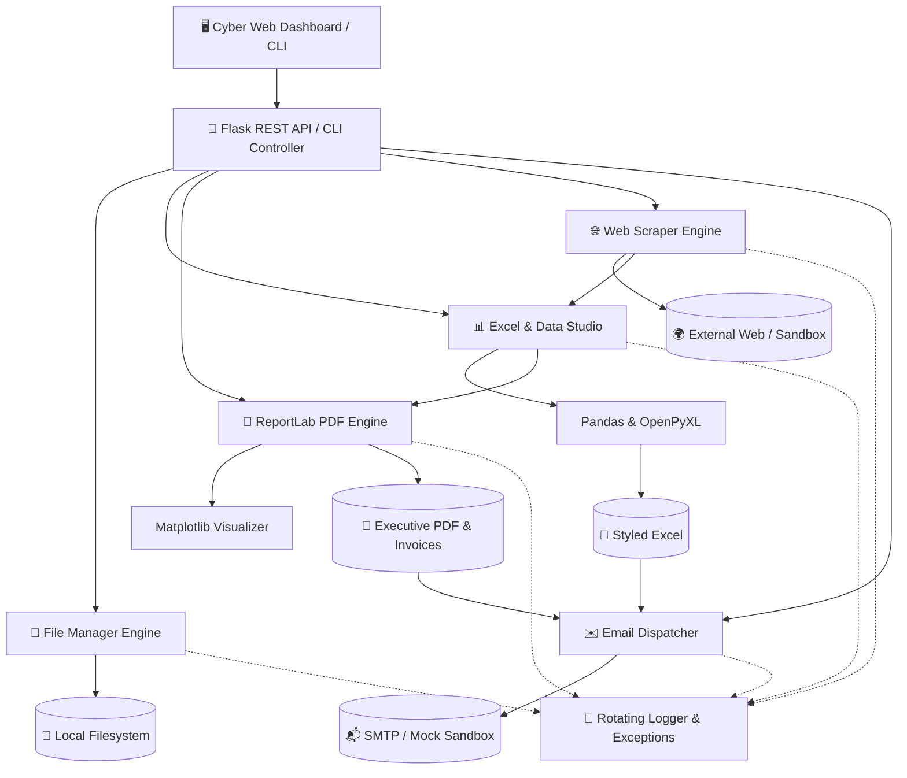

# ⚡ DataFlow Automator Pro
> **Enterprise-Grade File Automation, Data Processing & Workflow Intelligence Suite**

[](https://python.org)
[](https://opensource.org/licenses/MIT)
[](https://flask.palletsprojects.com/)
[](#-test-suite)
[](docs/Project_Report.pdf)

---

## 📌 Overview

**DataFlow Automator Pro** is a modular automation system designed to eliminate repetitive operational overhead. It seamlessly automates file organization, dataset cleaning and aggregation, high-fidelity PDF report synthesis, automated email distribution with attachments, and multi-source web scraping.

The system offers **dual interaction interfaces**:
1. **Cyber-Modern Glassmorphic Web Dashboard**: An interactive, responsive SPA with live telemetry, drag-and-drop ingestion, in-browser PDF previews, and real-time log streaming.
2. **Comprehensive Command-Line Interface (CLI)**: High-speed subcommands for scripting, server execution, and cron automation.

---

## 🌟 Key Features

### 1. 📁 Smart File Automation (`core/file_manager.py`)
- **Multi-Strategy Categorization:** Organize messy folders by category (Documents, Spreadsheets, Images, Audio, Video, Archives, Code), file extension, modification date (`YYYY-MM`), or size tiers.
- **Cryptographic Duplicate Detection:** Identifies identical duplicate files using SHA-256 / MD5 hashing and calculates wasted storage space.
- **Tokenized Batch Renamer:** Regex substitution, sequential numbering (`001`, `002`), prefix/suffix injection, and casing transforms (`lower`, `upper`, `title`, `slug`).
- **Automated Archiver & Cleaner:** Moves stale files older than *N* days to archive and compresses directories into `.zip` or `.tar.gz`.

### 2. 📊 Excel & Data Processing Studio (`core/excel_processor.py`)
- **Multi-Format Ingestion:** Load `.csv`, `.tsv`, `.xlsx`, `.xls`, and `.json` datasets.
- **Automated Data Sanitization:** Imputes missing values, strips whitespace, converts snake_case headers, auto-detects currency formats (`$1,250.00` → `1250.0`), and drops duplicate rows.
- **Pivot Tables & Aggregations:** Generates grouped summaries (`sum`, `mean`, `count`, `min`, `max`).
- **Styled Multi-Sheet Excel Exports:** Generates corporate-themed workbooks with dark navy headers, zebra striping, auto-fit column widths, number formats, and dynamic Excel formulas (`=SUM(...)`).

### 3. 📑 PDF Generation & Invoicing Engine (`core/pdf_engine.py`)
- **ReportLab Document Synthesis:** High-resolution vector PDF generation with custom headers, running footers, and two-pass `"Page X of Y"` numbering.
- **Embedded Visualizations:** Generates and embeds high-dpi Matplotlib charts (bar, donut, line).
- **Commercial Invoices:** Itemized line items, tax computation, discount subtotals, and corporate branding.

### 4. ✉️ Email Automation Dispatcher (`core/email_automator.py`)
- **Live SMTP & Safe Sandbox Mode:** Supports live TLS/SSL SMTP servers (Gmail, Outlook, custom) and includes a local mock sandbox mode for safe offline testing.
- **Jinja2 Dynamic HTML Templates:** Pre-built templates for executive summaries, invoice alerts, and system warnings.
- **Attachment Pipeline:** Automatically attaches generated PDFs, styled Excel spreadsheets, and ZIP archives.

### 5. 🌐 Web Scraping Pipeline (`core/web_scraper.py`)
- **Multi-Source Scraping:** Built-in scrapers for e-commerce books catalog, Hacker News tech headlines, quotes, and custom arbitrary URLs.
- **Resilience:** User-Agent header rotation, timeout protection, and exponential backoff retries.
- **Direct Pipeline Export:** Feeds harvested web data directly into Excel spreadsheets, PDF digests, or email queues.

### 6. 📜 Structured Logging & Custom Exceptions (`core/logger.py`, `core/exceptions.py`)
- **Rotating File Logs:** 5MB × 5 backups in `logs/automation.log`.
- **Colored Terminal Formatter:** ANSI-coded console debugging.
- **In-Memory Ring Buffer:** Real-time log streaming to the Web Dashboard.
- **Domain Exception Hierarchy:** Granular error handling (`FileOperationError`, `DataProcessingError`, `PDFGenerationError`, `EmailDispatchError`, `ScrapingError`, `WorkflowExecutionError`).

### 7. ⚡ Workflow Orchestrator (`core/orchestrator.py`)
- **End-to-End Automation Pipelines:** One-click execution chains:
  - *E-Commerce Intelligence:* Scrapes live catalog → Cleans with Pandas → Generates styled Excel → Synthesizes Executive PDF → Dispatches email.
  - *Sales Performance:* Ingests raw sales → Sanitizes nulls → Computes pivots → Produces styled XLSX + PDF Report → Dispatches to management.

---

## 🏗️ System Architecture



---

## 📂 Directory Structure

```
file-management/
├── app.py                      # Flask Web Application & REST API Server
├── cli.py                      # Command Line Interface (CLI) Application
├── generate_report.py          # Standalone PDF Project Report Generator
├── generate_samples.py         # Sample data & test files generator
├── requirements.txt            # Python dependencies
├── .gitignore                  # Git ignore rules
├── README.md                   # Complete Documentation
│
├── core/                       # Core Automation Engines
│   ├── __init__.py
│   ├── logger.py               # Rotating file, console & in-memory UI logs
│   ├── exceptions.py           # Domain custom exceptions
│   ├── file_manager.py         # Categorization, SHA-256 duplicates, renamer
│   ├── excel_processor.py      # Pandas data cleaning, pivots, styled XLSX
│   ├── pdf_engine.py           # ReportLab PDF synthesizer & invoices
│   ├── email_automator.py      # SMTP client, Jinja2 templates, sandbox
│   ├── web_scraper.py          # BeautifulSoup / Requests multi-scraper
│   └── orchestrator.py         # Multi-step pipeline execution chains
│
├── web/                        # Web Dashboard UI
│   ├── templates/
│   │   └── index.html          # Cyber-modern glassmorphic single-page app
│   └── static/
│       ├── css/
│       │   └── style.css       # Responsive design system & glassmorphism
│       └── js/
│           └── app.js          # Asynchronous controllers & live polling
│
├── docs/                       # Project Documentation & PDF Deliverable
│   ├── Project_Report.pdf      # Official publication-grade project report
│   └── report_benchmarks.png   # Performance benchmark chart
│
├── data/                       # Datasets & Sandboxes
│   ├── sample_files/           # Sample CSVs, XLSX, DOCX, duplicates, images
│   ├── sent_emails/            # Mock email sandbox storage
│   └── uploads/                # Uploaded datasets
│
├── exports/                    # Generated Excel workbooks & PDF reports
├── logs/                       # Rotating application logs
│   └── automation.log
│
└── tests/                      # Automated Unit Test Suite
    ├── test_file_manager.py    # File automation tests
    ├── test_excel_processor.py # Data cleaning & Excel export tests
    └── test_pdf_engine.py      # PDF, Email, and Scraper tests
```

---

## 🚀 Installation & Quick Start

### 1. Prerequisites
Ensure you have **Python 3.10+** installed:
```bash
python --version
```

### 2. Clone / Setup Workspace
```bash
git clone <repository-url>
cd "file management"
```

### 3. Install Dependencies
```bash
pip install -r requirements.txt
```

### 4. Generate Sample Test Data
```bash
python generate_samples.py
```

---

## 🖥️ Usage

### Option A: Launch Interactive Web Dashboard
Run the Flask server:
```bash
python app.py
```
Open **`http://127.0.0.1:5000`** in your browser to access the full cyber-modern dashboard.

---

### Option B: Command Line Interface (CLI)

The CLI exposes high-speed commands for all automation features:

#### 1. File Organization
```bash
# Organize by category (Documents, Images, Spreadsheets, etc.)
python cli.py organize data/sample_files --rule category

# Preview renames/moves without executing (Dry Run)
python cli.py organize data/sample_files --rule date --dry-run
```

#### 2. Duplicate Detection
```bash
# Scan directory for duplicate files by SHA-256 hash
python cli.py duplicates data/sample_files

# Scan and delete duplicate copies
python cli.py duplicates data/sample_files --delete
```

#### 3. Batch Renaming
```bash
# Add prefix and sequential numbering
python cli.py rename data/sample_files --prefix "doc_" --numbering

# Convert filenames to clean slug style
python cli.py rename data/sample_files --case slug
```

#### 4. Excel & Data Processing
```bash
# Ingest raw CSV, auto-clean, and export styled Excel workbook
python cli.py excel data/sample_files/sales_q3_raw.csv --output exports/sales_cleaned.xlsx
```

#### 5. Web Scraping
```bash
# Scrape e-commerce books catalog into styled Excel
python cli.py scrape books --pages 2 --output exports/books_scraped.xlsx

# Scrape tech news headlines
python cli.py scrape news --pages 2 --output exports/tech_news.csv
```

#### 6. Run Automated Pipeline
```bash
# Run End-to-End E-Commerce Pipeline
python cli.py pipeline ecommerce --email "stakeholder@company.com" --pages 2

# Run Sales Performance Pipeline
python cli.py pipeline sales --input data/sample_files/sales_q3_raw.csv --email "finance@company.com"
```

---

## 🧪 Test Suite

Run the automated test suite discovering all unit tests across modules:

```bash
python -m unittest discover -s tests
```

**Test Coverage Summary:**
- `test_file_manager.py`: Directory scanning, SHA-256 duplicate detection, batch renaming, rule organization, zip archive compression.
- `test_excel_processor.py`: Multi-format dataset ingestion, missing value imputation, type casting, pivot aggregations, styled Excel exports.
- `test_pdf_engine.py`: ReportLab executive report synthesis, invoice PDF generation, embedded chart verification.
- `test_email_automator.py`: Mock sandbox dispatching, Jinja2 template rendering, attachment tracking.
- `test_web_scraper.py`: Scraper initialization and session headers validation.

---

## 📕 Project Report (PDF Deliverable)

A publication-grade **Project Report PDF** is included under [`docs/Project_Report.pdf`](docs/Project_Report.pdf).

To regenerate the report at any time:
```bash
python generate_report.py
```

The report details:
- Executive Summary & Problem Scope
- Component Architecture Matrix
- Performance Benchmarks & Reliability Metrics
- Exception Handling Strategy
- Verification & Test Results

---

## 📄 License
This project is open-source and licensed under the [MIT License](LICENSE).
